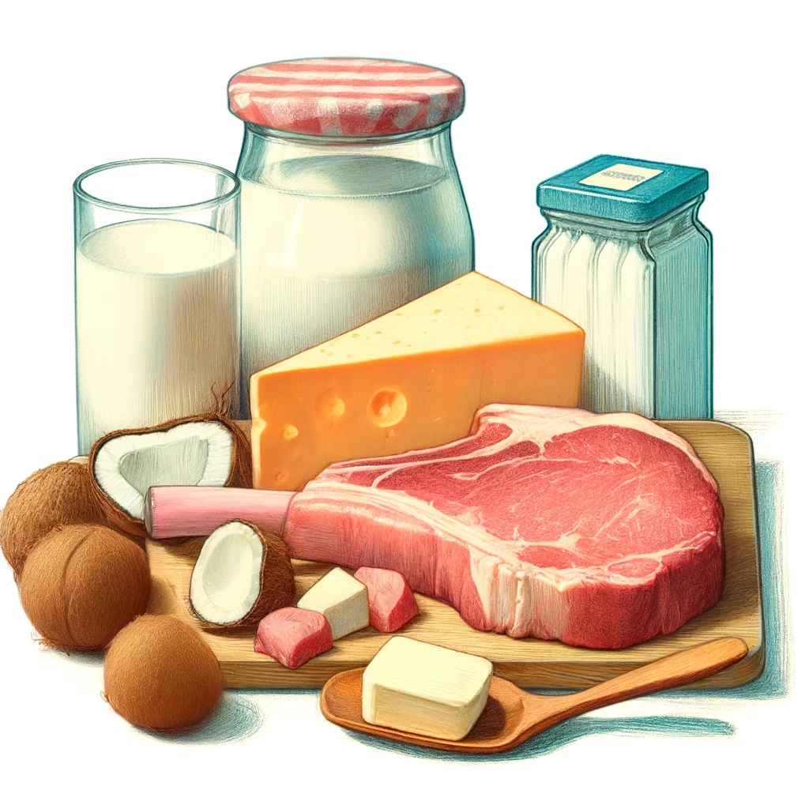

# Fats.

Fats are an essential part of a balanced diet, providing energy, supporting cell growth, and helping our bodies absorb vital nutrients. However, not all fats are created equal. Some fats promote health, while others can increase the risk of chronic diseases. Let's explore the different types of fats and their impact on our well-being" (Lawrence, 2013; Mozaffarian, Appel, and Van Horn, 2010).

## Types of Fats

These are the four main types of fats, order from healthy to least healthy. 

1. Monounsaturated fats
2. Polyunsaturated fats
3. Saturated fats
4. Trans fats

### Monounsaturated Fats

Monounsaturated fats are considered healthy fats and can help lower LDL cholesterol levels and reduce the risk of heart disease. These fats are found in:
- Olive, canola, and peanut oils
- Avocados
- Nuts (e.g., almonds, cashews, and pecans)

### Polyunsaturated Fats

Polyunsaturated fats are also considered healthy fats and are essential for overall health. There are two main types of polyunsaturated fats:
1. **Omega-3 fatty acids:** Found in fatty fish (e.g., salmon, mackerel, and sardines), flaxseeds, chia seeds, and walnuts. Omega-3s have anti-inflammatory properties and can help reduce the risk of heart disease, stroke, and certain cancers.
2. **Omega-6 fatty acids:** Found in vegetable oils (e.g., soybean, corn, and sunflower oil), nuts, and seeds. While omega-6s are essential for health, consuming too much can lead to inflammation in the body.

### Saturated Fats

Saturated fats are typically solid at room temperature and are primarily found in animal products, such as:
- Beef, pork, and lamb
- Butter, cheese, and whole milk
- Coconut and palm oil

>[!CAUTION]
>Consuming excessive amounts of saturated fats can raise levels of low-density lipoprotein (LDL) cholesterol, also known as "bad" cholesterol. High LDL cholesterol levels can increase the risk of heart disease and stroke.

### Trans Fats

Trans fats are the least healthy type of fat. They are created through a process called hydrogenation, which turns liquid oils into solid fats. Trans fats are commonly found in:

- Fried foods
- Baked goods (e.g., cookies, crackers, and pastries)
- Margarine and shortening

>[!CAUTION]
>Trans fats not only raise LDL cholesterol levels but also lower high-density lipoprotein (HDL) cholesterol, or "good" cholesterol. Consuming trans fats significantly increases the risk of heart disease, stroke, and type 2 diabetes.

## Understanding Cholesterol

Cholesterol is a waxy substance that is naturally present in the body's cells. It is essential for producing hormones, vitamin D, and substances that help digest foods. The body produces all the cholesterol it needs through a complex process that takes place primarily in the liver, but it can also be obtained from animal-based foods like meat, poultry, and dairy products.

There are two main types of cholesterol:

1. **Low-density lipoprotein (LDL):**  often referred to as "bad" cholesterol. High levels of LDL cholesterol can lead to the buildup of plaque in the arteries, increasing the risk of heart disease and stroke.
2. **High-density lipoprotein (HDL):** often called "good" cholesterol. HDL cholesterol helps remove LDL cholesterol from the arteries and transport it back to the liver, where it can be broken down and eliminated from the body.

One of the main goals of a healthy diet is to reduce LDL (bad) cholesterol and increase HDL (good) cholesterol. This can be achieved by consuming a diet low in saturated and trans fats, rich in fruits, vegetables, whole grains, lean proteins, and healthy fats like monounsaturated and polyunsaturated fats.

### Cholesterol Levels

When it comes to cholesterol levels, it's important to maintain a healthy balance. The following are the general guidelines for healthy cholesterol levels in adults[1]

- Total cholesterol: Less than 200 mg/dL (milligrams per deciliter)
- LDL cholesterol:
	- Optimal: Less than 100 mg/dL
	- Near optimal: 100-129 mg/dL
	- Borderline high: 130-159 mg/dL
	- High: 160-189 mg/dL
	- Very high: 190 mg/dL and above
- HDL cholesterol:
	- Low (increases risk of heart disease): Less than 40 mg/dL for men, less than 50 mg/dL for women
	- High (protective against heart disease): 60 mg/dL and above

## Common Myths 

### Eating fat makes you fat.

> "Despite decades of dietary advice that the lower the total fat content, the healthier the diet, researchers and public health authorities now agree that to consider the effect of total fat intake alone on health is meaningless; different types of fats must be considered" (Mozaffarian, Appel, and Van Horn, 2010).

There is a common myth that eating fats directly leads to weight gain and that low-fat products are inherently healthier. This misconception has led many people to avoid fats altogether, often replacing them with processed, high-sugar alternatives. However, the reality is more complex.

Fats are more calorie-dense than carbohydrates and proteins, with 9 calories per gram compared to 4 calories per gram. This higher calorie content can contribute to weight gain if consumed in excess. However, the type of fat consumed and the overall balance of one's diet are more important factors in maintaining a healthy weight.

In response to the low-fat trend, many food manufacturers began producing low-fat or fat-free versions of their products. However, to maintain taste and texture, they often replace the removed fats with added sugars, refined carbohydrates, or other unhealthy ingredients. As a result, these low-fat products can end up being less healthy than their full-fat counterparts.

For example, a low-fat flavored yogurt might have more sugar and calories than a full-fat plain yogurt. Similarly, low-fat salad dressings often contain more sugar and additives to compensate for the reduced fat content.

Furthermore, consuming healthy fats in moderation can actually support weight management and overall health. Monounsaturated and polyunsaturated fats help to promote feelings of satiety, which can reduce overeating and snacking between meals. These healthy fats also play crucial roles in hormone production, nutrient absorption, and brain function.

Instead of focusing on low-fat diets, it's more important to prioritize overall diet quality. This means choosing whole, minimally processed foods, including healthy fat sources like nuts, seeds, avocados, and fatty fish, while limiting intake of refined carbohydrates, added sugars, and unhealthy fats like trans fats.

### Eating high-fat foods will raise your cholesterol levels. 

Dietary cholesterol found in foods like eggs and shellfish has less impact on blood cholesterol levels than previously thought. Saturated and trans fats have a more significant effect on raising LDL cholesterol levels. The overall balance of fats and nutrients in the diet, along with other lifestyle factors, plays a more substantial role in determining blood cholesterol levels.

### Eggs raise cholesterol levels and increase the risk of heart disease

For many years, eggs were believed to raise blood cholesterol levels and increase the risk of heart disease due to their high dietary cholesterol content. One large egg contains about 186 milligrams of cholesterol, which led to the recommendation to limit egg consumption.

However, recent studies have shown that dietary cholesterol has less impact on blood cholesterol levels than previously thought. The 2015-2020 Dietary Guidelines for Americans removed the recommendation to limit dietary cholesterol to 300 milligrams per day, stating that cholesterol is not a nutrient of concern for overconsumption (U.S. Department of Health and Human Services & U.S. Department of Agriculture, 2015).

Research has shown that consuming eggs as part of a balanced diet does not significantly increase the risk of heart disease in most people. A meta-analysis of prospective cohort studies found no significant association between egg consumption and the risk of coronary heart disease or stroke (Rong et al., 2013).
Eggs are also a nutritious food, providing high-quality protein, vitamins (such as vitamin D, vitamin B12, and vitamin A), minerals (such as selenium and choline), and antioxidants (such as lutein and zeaxanthin). These nutrients are important for maintaining overall health, including eye, brain, and liver function.
### Margarine is a healthier alternative to butter.

Many margarine products, especially older formulations, contain trans fats, which are the least healthy type of fat. Trans fats raise LDL cholesterol and lower HDL cholesterol, increasing the risk of heart disease. Some newer margarine products have been reformulated to remove trans fats, but butter from grass-fed cows, consumed in moderation, can be a healthier choice due to its nutrient content.

### Cooking with olive oil is unhealthy due to its low smoke point. 

While it's true that extra virgin olive oil has a lower smoke point compared to some other cooking oils, it is still a healthy choice for cooking at low to medium temperatures. Olive oil is rich in monounsaturated fats and antioxidants, which can provide health benefits. For high-heat cooking, oils with higher smoke points like avocado oil or refined coconut oil can be used.

## References

- U.S. Department of Health and Human Services & U.S. Department of Agriculture. (2015). 2015-2020 Dietary Guidelines for Americans. 8th Edition. Retrieved from [https://health.gov/our-work/food-nutrition/previous-dietary-guidelines/2015](https://health.gov/our-work/food-nutrition/previous-dietary-guidelines/2015)
- Rong, Y., Chen, L., Zhu, T., Song, Y., Yu, M., Shan, Z., Sands, A., Hu, F. B., & Liu, L. (2013). Egg consumption and risk of coronary heart disease and stroke: dose-response meta-analysis of prospective cohort studies. BMJ, 346, e8539. [https://doi.org/10.1136/bmj.e8539](https://doi.org/10.1136/bmj.e8539)
- Lawrence, G.D. (2013) 'A healthy approach to dietary fats: understanding the science and taking action to reduce consumer confusion', Nutrition Journal, 12, p. 164. Available at: https://nutritionj.biomedcentral.com/articles/10.1186/1475-2891-12-164 (Accessed: 24 April 2024).
- Mozaffarian, D., Appel, L.J., and Van Horn, L. (2010) 'Dietary fat and cardiometabolic health: evidence, controversies, and consensus for guidance', The BMJ, 341, c4222. Available at: https://www.bmj.com/content/361/bmj.k2139 (Accessed: 24 April 2024).

[1]: https://www.nhlbi.nih.gov/files/docs/guidelines/atp3xsum.pdf