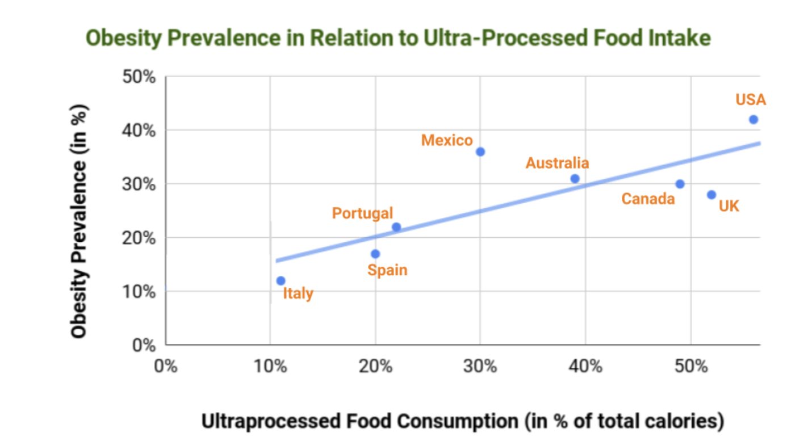

# Losing Weight.

::: details Key Takeaways

- **The Obesity Epidemic:** Obesity rates have skyrocketed in recent decades, with processed foods and hormonal imbalances playing a significant role in weight gain.
- **What Causes Weight Gain:** While a calorie surplus is the direct cause of weight gain, the ultimate causes are rooted in the mismatch between our modern food environment and our biological systems, leading to hormonal imbalances and overconsumption.
- **Understanding Weight Loss:** True weight loss involves losing excess body fat while preserving lean muscle mass, not just reducing the number on the scale.
- **The Problem with Diets:** Most diets fail due to their unsustainable nature and the body's adaptive responses, such as decreased metabolism and increased hunger.
- **Calories and Hormones Matter:** Not all calories are the same. The type of calories consumed significantly impacts hormonal responses and fat storage. Insulin plays a crucial role as it regulates fat storage and influences weight loss.
- **How the Body Burns Fat:** When insulin levels are low and glycogen stores are depleted, the body shifts into a fat-burning state, breaking down stored fat into fatty acids and ketones for energy.
- **Optimal Fat Loss Strategy:** Eat whole, minimally processed foods. Lower insulin levels through  moderate calorie reduction, fewer carbs, intermittent fasting, and regular physical activity.
- **Universal Biological Principles:** Despite individual differences, fundamental biological mechanisms like insulin response are consistent among humans and significantly influence how dietary changes affect weight loss.
- **Debunking Myths:** Common weight loss myths, such as the effectiveness of rapid weight loss, spot reduction, and the need for breakfast, are addressed and dispelled.

:::

Achieving and maintaining a healthy weight is a common goal, with benefits for physical health, self-confidence, and overall quality of life.  

> "Let food be thy medicine and medicine be thy food." **Hippocrates.**

If you're overweight, reducing your weight should be *the* priority of your life. You will get the most investment back for your attention, as a health body makes everything else in this guide easier. 

But, many people struggle to lose weight. 

They follow the typical advice of *"eat less, move more"*. They get some initial results. Then, progress slows down. 

*They feel like shit* — no energy, cold, hungry, and full of cravings. 

And on top of it all, they appear to lack the discipline or will power to actually stick through it all. In other words, it is *their fault.* So not only are they fat, but also morally reprehensible! 

It's no surprise that they gain back all the weight and some more. [^mann]

In today's food environment, filled with highly processed, calorie-dense foods, it's more important than ever to be intentional about what we eat. Without a clear understanding of how different foods affect our bodies, it's easy to consume excess calories without realizing it.

**This guide is designed to give you all the knowledge you need to make the lifestyle changes required to *permanently* lose fat and maintain a healthy weight, *without relying on short-term diets or extreme measures.***

By the end of this, you will know what causes weight gain, precisely how the body burns fat, and the optimal strategy for fat loss. 

Remember, this is under your control. You can choose what you put into your body.

> "Hunger is the first element of self-discipline. If you can control what you eat and drink, you can control everything else.” **Dr. Umar Faruq Abd-Allah.**

## Introduction to Obesity

The World Health Organization defines[^who] overweight and obese as:

> The diagnosis of overweight and obesity is made by measuring people’s weight and height and by calculating the [body mass index (BMI)](/health/bmi): weight (kg)/height² (m²). The body mass index is a surrogate marker of fatness and additional measurements, such as the waist circumference, can help the diagnosis of obesity. For adults, WHO defines overweight and obesity as follows: **Overweight is a BMI greater than or equal to 25**; and **Obesity is a BMI greater than or equal to 30.**

::: details What is BMI?
[BMI (Body Mass Index)](/health/bmi) is a calculation used to assess body fat levels based on an individual's weight and height. It is calculated by dividing a person's weight in kilograms by their height in meters squared (kg/m²). 

However, [BMI](/health/bmi) does not directly measure body fat percentage and may not accurately reflect the body composition of those with high muscle mass.
:::

## Obesity & General Health

Being overweight is one of the main triggers for many [Non-Communicable Diseases](/health/non-communicable-diseases) which are the leading cause of death worldwide. [^who-ncd]

EXPAND THIS SECTION
### A Global Problem

The picture for modern society is grim.

As of 2023, 16% of adults are obese and 43% overweight across the world. **The worldwide prevalence of obesity more than doubled between 1990 and 2022.** For children and adolescents, the picture is even worse. In 1990 there was a 2% obesity rate (31M young people) and this has grown to 8% (160M young people). [^who]

GOOD TO PUT A GRAPH HERE OF HISTORICAL OBESITY RATES

Obesity is now a bigger problem than malnutrition in many parts of the world, highlighting a shift in global health concerns from traditional undernutrition to excessive nutrition-related chronic conditions like cardiovascular disease and diabetes. ​ 

[You can check where your country ranks in obesity here.](https://data.worldobesity.org/rankings/)

That said, you do not have to be part of these statistics. 

## What Causes Weight Gain?

This might seem a strange question. After all, it is obvious — weight gain is caused by eating too much and not moving enough.

So why does the *"Eat less, move more"* approach to dieting has such a huge failure rate? [^mann]

Perhaps it is one of those things that is simple, but difficult. 

Or there is something else going on. 

At a fundamental level, weight gain *does* occur when you consistently consume more calories than your body expends. This is the *direct* cause of weight gain — a sustained calorie surplus leads to the body storing excess energy as fat.

However, it's important to look beyond this simple *"calories in vs calories out"* model to understand the *root* causes driving the obesity epidemic. 

After all, obesity rates have skyrocketed in recent decades, but it's unlikely that this is due to a sudden mass loss of willpower and self-control.

So then, we need to ask why ([in the style of Richard Feynman](https://www.youtube.com/watch?v=36GT2zI8lVA))  are peopleconsistently consuming too many calories?

The root cause is the mismatch between our modern food environment and the biological systems that regulate our appetite, metabolism and weight.  

Over millions of years of evolution, our bodies developed intricate hormonal and neurological feedback mechanisms to maintain a healthy weight. These systems worked well when our diets consisted of minimally processed whole foods.

However, the rise of the modern processed food industry in the 20th century has introduced an abundance of calorie-dense, nutrient-poor, intensely palatable foods. These foods are often engineered to override our natural satiety cues, encouraging excessive consumption.

::: details The Satiety Mechanism Explained
The body has a built-in system called the "satiety mechanism," which relies on stretch receptors in the stomach and nutrient receptors in the small intestine to signal when we've eaten enough (Lisle & Goldhamer, 2006). When we eat whole, unprocessed foods that are high in fiber and nutrients but relatively low in calorie density, this mechanism works effectively to prevent overeating and maintain a healthy weight.

Modern processed foods, which are often high in calories but low in fiber and nutrients, can override the satiety mechanism, leading to overconsumption and weight gain. These foods are often designed to be highly palatable and easy to eat in large quantities, making it difficult for the body to accurately gauge calorie intake (Moss, 2013).

In their natural habitat, monkeys and other animals rarely become obese or undernourished, as their bodies are able to accurately regulate food intake based on their energy needs. [^goldhamer] This is because their diets consist primarily of whole, unprocessed foods that are in line with their evolutionary history.

In contrast, when animals (including humans) are exposed to processed, calorie-dense foods that are out of sync with their natural diets, their satiety mechanisms can be disrupted, leading to overconsumption and weight gain (Erlanson-Albertsson, 2005).

To support sustainable weight loss and overall health, it's essential to focus on eating primarily whole, unprocessed foods that are nutrient-dense and high in fiber. By doing so, we can work with our body's natural regulatory mechanisms to maintain a healthy weight and prevent the overconsumption associated with processed, calorie-dense foods.

When you focus on eating whole, unprocessed foods like fruits, vegetables, whole grains, and lean proteins, there is often no need to meticulously count calories for weight management. This is because these foods tend to be nutrient-dense and high in fiber, which helps to naturally regulate appetite and food intake (Rolls, 2009).

For example, Broccoli is a low-calorie, high-fiber vegetable that is rich in vitamins, minerals, and antioxidants. It has a low calorie density, meaning you can eat a large volume of broccoli without consuming many calories, and its high fiber content helps to promote feelings of fullness (Rolls, Ello-Martin, & Tohill, 2004). As a result, it is very difficult to overeat on broccoli.

Similarly, bananas are a nutritious fruit that contains fiber, potassium, and various vitamins and minerals. While they are higher in calories than broccoli, they still have a relatively low calorie density compared to processed snacks like chips or cookies. The fiber in bananas helps to slow digestion and promote satiety, making it unlikely that you would overconsume them (Slavin & Lloyd, 2012).
::: 

 Whereas it's quite difficult to overeat whole foods like broccoli or apples, it's very easy to overeat pizza, ice cream, french fries, soda, etc.

In particular, processed foods high in refined carbohydrates and added sugars have been shown to disrupt the hormones that regulate hunger, fullness and fat storage - especially insulin. When we eat refined carbs and sugar, we get a rapid spike in blood glucose. The body responds by releasing large amounts of insulin to shuttle the glucose out of the bloodstream. Over time, a diet consistently high in processed carbs can lead to chronically elevated insulin levels.

> [!TIP] 🧠 Brain Meet World
> Guide2Life covers in-depth the mismatch between our evolutionary psychology, powered by our 200,000 year old brains and modern lifestyle in our section [Brain Meets World. ](/start/brain-meets-world)
> 
> Modern diets are another example where the environment has changed much faster than the rate of evolution and our ability to adapt.

Since insulin is the body's main fat storage hormone, this hormonal imbalance makes it much harder to access stored body fat for energy. The body becomes trapped in a vicious cycle of hunger, craving and fat storage, even in the presence of large fat reserves. This is why many people struggle to lose weight even while constantly battling hunger.

::: details Leptin Resistance
In a properly functioning metabolic system, the presence of large fat stores should trigger a reduction in hunger hormones and an increase in satiety hormones, leading to a decrease in appetite and food intake.

One of the key hormones involved in this process is Leptin. Leptin is produced by fat cells and acts as a signal to the brain to indicate the body's energy reserves. In a healthy individual, higher levels of body fat lead to increased Leptin production, which should signal the brain to reduce hunger and increase energy expenditure.

However, in many individuals with obesity, this system can become badly regulated, leading to a condition known as Leptin Resistance. In this state, despite high levels of leptin due to large fat stores, the brain becomes less sensitive to the hormone's signals. As a result, the brain may not receive the appropriate feedback to reduce hunger and increase satiety, even in the presence of ample energy reserves.
:::

So while a calorie surplus is the mechanism by which fat is gained, it appears that processed modern foods and the hormonal havoc they wreak are the key drivers of the obesity epidemic. By understanding the effects of different foods on our hormones, we can craft diets that work with rather than against our biology to naturally promote a healthy weight.

So it's not:

**Too much food** -> **Obesity**

but rather:

**Hormonal Inbalance** --> **Too much food** -> **Obesity**

## Understanding Weight Loss

When we say "losing weight," we specifically mean *losing excess body fat* while preserving lean muscle mass. 

This distinction is crucial because many fad diets and quick-fix solutions often lead to rapid weight loss, but this weight loss can come from a combination of fat, muscle, and water. Losing lean muscle mass can be detrimental to overall health and can slow down metabolism, making it harder to maintain weight loss in the long run. [^cava]  

Therefore, the focus should be on adopting evidence-based strategies that promote fat loss while maintaining or even building lean muscle mass for sustainable, healthy weight management.

**You can only lose weight if you have a consistent calorie deficit. You must burn more calories than you eat — period.** 

::: details The First Law of Thermodynamics
The First Law of Thermodynamics states that energy cannot be created or destroyed; it can only be transformed or transferred from one form to another. 

In the context of weight loss, this means that the energy (calories) you consume through food and drinks must be either used by your body for various functions (such as maintaining body temperature, powering physical activity, and supporting cellular processes) or stored (primarily as body fat).

If you consume more energy than your body expends, the excess energy will be stored, leading to weight gain. Conversely, if you expend more energy than you consume, your body will need to tap into its stored energy reserves (body fat) to make up for the deficit, resulting in weight loss.
:::

## How the Body Burns Fat
### Calories In vs. Calories Out

The "calories in, calories out" (CICO) model has long been the standard way to think about weight loss. According to this model, losing weight simply involves consuming fewer calories than you burn. This principle underlies many traditional dieting strategies and emphasizes caloric deficit as the key to weight loss. [^hall] 

Recent scrutiny reveals that the CICO model might be too simplistic. It overlooks complex hormonal and metabolic factors that also play crucial roles in how our bodies regulate weight. Notably, it fails to account for how different types of calories are metabolized differently by the body:

- **Hormonal Impact of Macronutrients:** Different foods can trigger varied hormonal responses that directly affect our metabolism and fat storage. For instance, sugars and refined carbohydrates tend to raise insulin levels, which in turn promotes fat storage. This effect is less pronounced with calories from proteins or fats. [^fung]
- **Adaptive Metabolism:** The body adapts to calorie restriction by adjusting metabolic rates. Decreases in metabolism and increases in hunger hormones like ghrelin make sustained weight loss challenging and can lead to a weight loss plateau. [^rosenbaum2010]  [^sumithran] 
- **Quality of Calories:** The source and quality of calories consumed can influence satiety, metabolic rate, and overall health. Calories from whole, nutrient-dense foods affect the body differently than calories from processed foods, which are often less satisfying and more prone to cause overeating.

This means that not all calories are the same, because different types of calories affect the body differently. For example, calories from sugar can impact insulin levels more than calories from protein, influencing how much fat the body stores.

>[!TIP] Quality & Quantity
>This suggests that the source of calories matters just as much as the amount. For instance, a diet high in proteins and healthy fats might lead to better fat burning compared to a diet high in sugars and processed foods, even if both diets contain the same total calories. 
>
> **This difference is crucial for understanding effective weight management strategies.**

The following graph, showing how rates of obesity in various countries are highly correlated to the percentages of calories that come from ultra-processed foods, support this view. This graph was prepared by [Mario Kratz, PHD](https://nourishedbyscience.com/)

While the fundamental physics of the CICO model—that you must burn more calories than you consume to lose fat—remains valid, this model does not capture the full complexity of human metabolism. Effective weight management requires considering not just the quantity of calories but also their quality and the timing of consumption.

For further information, we suggest you watch [this video on the hormonal model vs the CICO model by Dr. Jason Fung.](https://www.youtube.com/watch?v=ZKC3hiyLeRc)

### The Role of Insulin
Insulin is a hormone produced by the pancreas that regulates blood sugar levels and plays a crucial role in fat storage. When you eat, especially carbohydrates, your blood sugar levels rise, and insulin is released to shuttle the glucose into your cells for energy or storage (Petersen & Shulman, 2018).

Insulin is often referred to as the "gatekeeper" of fat storage. High levels of insulin promote fat storage, while low levels of insulin allow for fat burning. [^dimitriadis] This is why individuals with Type 1 Diabetes, who cannot produce insulin, can lose weight rapidly and face life-threatening complications if not treated with insulin injections, regardless of how much they eat (Frandsen & Svensson, 2021).

### Fat Burning & Glycogen Stores

To effectively lose body fat, it's essential to understand the underlying biological processes involved in fat burning and the role of glycogen stores in this process.

#### Glycogen: The Body's Stored Carbohydrates

When you consume carbohydrates, your body breaks them down into glucose, which is then used for immediate energy needs or stored in the liver and muscles as glycogen (Jensen et al., 2011). 

Your liver can store around 100g of Glycogen, and your muscles a further 400-500g. In total, you have around 1,600 to 2,000 calories of Glycogen available.  These stores are used differently: liver glycogen helps maintain blood sugar levels, while muscle glycogen is primarily used to fuel muscle activity.

Glycogen is the body's primary source of stored energy and is readily accessible for quick energy release when needed (Acheson et al., 1988).

### Prioritizing Glycogen for Energy

When your body requires energy, there is a priority order based on how easy it is for the body to access the energy:

1. **Glucose in the Bloodstream**: Glucose is the body’s primary and most accessible energy source, utilized first due to its immediate availability in the bloodstream.
2. **Glycogen in Liver and Muscles**: As glucose levels drop, the body taps into glycogen stores. The liver converts its glycogen to glucose for the bloodstream, supporting overall energy needs and brain function. Muscles use their glycogen locally during physical activity. As long as there are sufficient glycogen stores, your body will preferentially use these stores for energy rather than tapping into stored fat. [^acheson] 
3. **Fat Stores**: When glycogen is depleted, typically after hours of fasting or intense exercise, the body shifts to fat. It breaks down fat into fatty acids and glycerol for energy, a process that is slower and more involved than using glucose or glycogen.
4. **Protein from Lean Muscle Mass**: In extreme cases of energy shortage, the body resorts to muscle protein, converting it into amino acids. Some are transformed into glucose via gluconeogenesis to support vital functions when other energy sources are scarce.

### Depleting Glycogen Stores for Fat Burning

To shift your body into a fat-burning state, you need to deplete your glycogen stores. This can be achieved through a combination of reduced carbohydrate intake and increased physical activity (Volek et al., 2015). Once glycogen stores are depleted, your body is forced to turn to stored fat for energy, leading to fat loss.

### The Fat-Burning Process

When glycogen stores are low, your body releases fatty acids from adipose tissue (fat cells) through a process called lipolysis (Duncan et al., 2007). These fatty acids are then transported to various tissues, including the liver and muscles, where they are metabolized for energy through a process called beta-oxidation (Houten & Wanders, 2010).

### Ketosis: An Advanced Fat-Burning State

In the absence of sufficient glucose and glycogen, your liver produces ketones from fatty acids. This metabolic state, known as ketosis, is an efficient way for your body to use stored fat for energy (Paoli et al., 2015). Very low-carbohydrate diets, such as the ketogenic diet, aim to induce and maintain a state of ketosis to promote fat burning (Volek & Phinney, 2011).

By understanding the role of glycogen stores and the fat-burning process, you can make informed decisions about your diet and exercise routines to optimize fat loss. Strategies such as reducing carbohydrate intake, increasing physical activity, and considering low-carbohydrate or ketogenic diets can help deplete glycogen stores and promote fat burning.

## The Problem with Diets

>[!CAUTION] ❌ Beware of Fad Diets
> A fad diet is a weight loss plan that promises fast, dramatic results through unsustainable and unbalanced eating. These diets, often involving restrictive or unusual food choices, focus on quick weight loss rather than long-term health. [^dulloo]
> 
> 
> **95% of diets fail — most people regain the weight they lost and more. [^mann]**

The problem with diets is that the body adapts to calorie restriction by slowing down metabolism and increasing feelings of hunger, making it difficult to sustain the calorie deficit necessary for continued weight loss. [^fung]

When you drastically reduce your calorie intake, your body perceives this as a potential threat to survival and activates a series of adaptive mechanisms to conserve energy. [^muller] 

These adaptations include:

- **Decreased resting metabolic rate:** Your body starts burning fewer calories at rest to conserve energy. [^rosenbaum2010]
- **Increased hunger and appetite:** Hormonal changes, such as increased levels of ghrelin (the "hunger hormone") and decreased levels of leptin (the "satiety hormone"), lead to increased feelings of hunger and cravings. [^suminthran] 
- **Reduced non-exercise activity thermogenesis NEAT:** Your body unconsciously reduces energy expenditure through fidgeting, postural changes, and other small movements. [^rosenbaum2003] 

As a result of these adaptations, you may experience a stop in weight loss despite maintaining what was previously a calorie deficit. 

To continue losing weight, you would need to further reduce your calorie intake, which can lead to feelings of deprivation, fatigue, and frustration. This cycle of constantly cutting calories and battling hunger is one of the main reasons why many people find it challenging to sustain long-term weight loss through calorie restriction alone.

Moreover, severe calorie restriction can lead to the loss of lean muscle mass, which further slows down metabolism and makes it easier to regain weight once you return to your normal eating habits. [^cava] 

>[!CAUTION] ⛔️  The Universality of Human Biology
> Humans share the vast majority  (99.9%) of their DNA. [citation?]This means that, despite the trend of personalized diets, our bodies react in remarkably consistent ways to similar dietary approaches. [^loannidis] For example, if we were to hypothetically give any person a pill that stops their body from producing insulin, they would experience rapid weight loss, regardless of their individual characteristics (Frandsen & Svensson, 2021).
>
> While individual preferences and sustainability should be considered when choosing a fat loss approach, it is equally important to focus on strategies that work with the fundamental biological mechanisms we all share. Understanding and leveraging these universal principles we can ensure we're on the right track.
> 
> **In other words, don't overoptimize — focus on getting the basic right.**

## Optimal Fat Loss Strategy

>[!DANGER]  ⛔️ A Note on Misinformation
> Weight loss is plagued by widespread misinformation. There are fad diets, misleading marketing claims, and unsubstantiated and conflicting advice that make weight loss a confusing and frustrating journey. 
> 
> To ensure the accuracy and reliability of the information presented here, this page includes a _significant number of references_ to peer-reviewed scientific studies and reputable sources. 
> 
> **You are encouraged to approach weight loss information with a critical eye. Prioritize evidence-based strategies over popular trends or anecdotal advice.**  

So what is the optimal fat loss strategy? 

The optimal fat loss strategy is one that:

- Easy to follow
- Focuses on hormonal changes
- Focuses on Nutrition vs Exercise

prioritizes diet over exercise, is relatively easy to follow, and focuses on hormonal changes rather than solely relying on the simplified "calories in vs. calories out" model. By understanding the fundamental biological mechanisms that regulate weight, we can develop an effective and sustainable approach to fat loss.

### Diet Over Exercise

While exercise can support fat loss efforts, it is not the primary driver of weight loss. The math simply doesn't work out – it's much easier to consume excess calories than it is to burn them off through exercise (Malhotra et al., 2015). Therefore, the optimal fat loss strategy must focus primarily on dietary changes.

### Sustainability and Ease
To avoid falling into the 95% of diets that fail (Mann et al., 2007), the optimal fat loss strategy must be relatively easy to follow and maintain long-term. Overly restrictive or complicated diets can lead to feelings of deprivation and frustration, increasing the likelihood of rebound weight gain (Dulloo & Montani, 2015). **The key is to find an approach that is simple, effective and sustainable.**
### Hormonal Focus: Insulin

While a calorie deficit is necessary for weight loss, the optimal fat loss strategy must also consider the hormonal impact of food choices, particularly the role of insulin. Insulin is a key regulator of fat storage and fat burning, with high levels promoting fat storage and low levels enabling fat burning (Dimitriadis et al., 2011).

Despite individual differences, the fundamental role of insulin in weight regulation remains consistent across all humans. [^loannidis] Strategies that lower insulin levels, such as low-carbohydrate diets and intermittent fasting, have been shown to promote fat loss in the majority of people (Westman et al., 2007; Mattson et al., 2017).

### Putting It All Together

The optimal fat loss strategy should include the following components:

- A focus on whole, minimally processed foods that are nutrient-dense and satiating, such as vegetables, fruits, lean proteins, and healthy fats (Rolls, 2009).
- A moderate reduction in overall calorie intake, achieved through mindful portion control and the selection of foods with lower calorie density (Rolls, 2009).
- A reduction in refined carbohydrates and added sugars to lower insulin levels and promote fat burning (Westman et al., 2007).
- The incorporation of intermittent fasting, if appropriate and sustainable for the individual, to further reduce insulin levels and enhance fat loss (Mattson et al., 2017).
- Regular physical activity, primarily for its health benefits and to support the maintenance of lean muscle mass during weight loss (Swift et al., 2018).

While individual differences can play a role in weight loss, it's essential not to overemphasize their importance. Despite the current trend of highly personalized diets, the reality is that we are all human, sharing the vast majority of our DNA, and our bodies react in remarkably similar ways to the same dietary approaches. [^loannidis] 

This is particularly evident when considering the role of insulin in weight regulation. Insulin is a fundamental hormone that operates consistently across the human species. If we were to hypothetically give any person a pill that stops their body from producing insulin, they would experience rapid weight loss, regardless of their individual characteristics (Frandsen & Svensson, 2021). This demonstrates the universal importance of insulin in fat storage and fat burning.

While factors such as genetics, age, sex, and lifestyle can influence the speed and ease of weight loss, the underlying principles remain the same for everyone. A diet that reduces insulin levels, such as a low-carbohydrate diet or intermittent fasting, will promote fat burning and weight loss in the vast majority of people (Westman et al., 2007; Mattson et al., 2017).

Therefore, while it's important to consider individual preferences and sustainability when choosing a weight loss approach, it's equally crucial to recognize the fundamental biological mechanisms that we all share. By focusing on strategies that work with these universal mechanisms, such as optimizing insulin levels, we can develop effective and widely applicable approaches to weight loss and improved health.

## Common Myths

### Rapid Weight Loss is Sustainable
Crash diets and rapid weight loss techniques may lead to initial weight loss, but they are often difficult to maintain long-term and can lead to weight regain. Slow, gradual weight loss through sustainable lifestyle changes is more likely to result in lasting success (Purcell et al., 2014).

### Spot Reduction
The belief that you can target fat loss in specific areas of the body through exercises that focus on those areas (e.g., doing crunches to lose belly fat). In reality, fat loss occurs throughout the body and cannot be targeted to specific regions (Ramírez-Campillo et al., 2013).

### Low-Fat Diets are Best for Weight Loss
While reducing [dietary fat](/health/nutrition/fats) can lead to a reduction in overall calorie intake, low-fat diets are not inherently superior for weight loss. In fact, low-carbohydrate, high-fat diets have been shown to be effective for weight loss and improving various health markers (Hu et al., 2012).

### Eating Small, Frequent Meals Boosts Metabolism
The idea that eating multiple small meals throughout the day can boost metabolism and promote weight loss is not supported by scientific evidence. Meal frequency does not appear to have a significant impact on weight loss (Schoenfeld et al., 2015).

### Carbohydrates Make You Fat
While [carbohydrates](/health/nutrition/carbohydrates) have been vilified in recent years, they are not inherently fattening. However, it's important to distinguish between different types of carbohydrates. [Whole, unprocessed carbohydrates](/health/nutrition/carbohydrates#complex-carbohydrates) such as fruits, vegetables, and whole grains are generally nutrient-dense and can be part of a healthy diet.

On the other hand, [highly refined carbohydrates](/health/nutrition/carbohydrates#simple-carbohydrates), such as those found in sugary beverages, candy, and processed snacks, can contribute to weight gain when consumed in excess. These types of carbohydrates are often high in calories but low in nutrients, and they can quickly raise blood sugar levels, leading to increased insulin production and potential fat storage (Ludwig et al., 2018).

However, it's important to note that excessive calorie intake, regardless of the macronutrient source, is still the main driver of weight gain (Buchholz & Schoeller, 2004). Consuming more calories than your body needs will lead to weight gain, whether those calories come from carbohydrates, fats, or proteins.

Therefore, rather than vilifying all carbohydrates, it's more helpful to focus on the quality of carbohydrates consumed and to maintain an overall balanced diet that supports healthy weight management.
### You Need to Eat Breakfast to Lose Weight
While eating breakfast can be part of a healthy lifestyle, it is not a requirement for weight loss. Studies have shown that skipping breakfast does not necessarily lead to weight gain or hinder weight loss efforts (Dhurandhar et al., 2014).

### You Can't Lose Weight Without Exercise
> "Diet is Batman and exercise is Robin. Diet does 95 percent of the work and deserves all the attention; so, logically, it would be sensible to focus on diet. Exercise is still healthy and important—just not equally important. It has many benefits, but weight loss is not among them." **Jason Fung.**
While exercise is important for overall health and can support weight loss efforts, it is not strictly necessary for weight loss. Creating a calorie deficit through dietary changes alone can lead to weight loss (Swift et al., 2014).

### Drinking Lemon Water Accelerates Fat Loss

## References

[^acheson]: Acheson, K. J., Schutz, Y., Bessard, T., Anantharaman, K., Flatt, J. P., & Jéquier, E. (1988). Glycogen storage capacity and de novo lipogenesis during massive carbohydrate overfeeding in man. The American Journal of Clinical Nutrition, 48(2), 240-247.

[^who]: World Health Organization. "Obesity and Overweight." Last modified March 1, 2024. [https://www.who.int/news-room/fact-sheets/detail/obesity-and-overweight](https://www.who.int/news-room/fact-sheets/detail/obesity-and-overweight).

[^who-ncd]: World Health Organization, "Noncommunicable diseases," World Health Organization, last modified September 16, 2023, [https://www.who.int/news-room/fact-sheets/detail/noncommunicable-diseases](https://www.who.int/news-room/fact-sheets/detail/noncommunicable-diseases).

[^mann]: Mann, Traci, A. Janet Tomiyama, Erika Westling, Ann-Marie Lew, Barbra Samuels, and Jason Chatman. "Medicare's Search for Effective Obesity Treatments: Diets Are Not the Answer." American Psychologist 62, no. 3 (2007): 220-233.

[^dulloo]: Dulloo, A.G. and Montani, J.P., 2015. Pathways from dieting to weight regain, to obesity and to the metabolic syndrome: An overview. Obesity Reviews, 16(S1), pp.1-6.

[^fung]: Fung, J. (2016). The obesity code: Unlocking the secrets of weight loss. Greystone Books.

[^muller]: Müller, M. J., & Bosy-Westphal, A. (2013). Adaptive thermogenesis with weight loss in humans. Obesity, 21(2), 218-228.

[^rosenbaum2010]: Rosenbaum, M., & Leibel, R. L. (2010). Adaptive thermogenesis in humans. International Journal of Obesity, 34(1), S47-S55.

[^rosenbaum2003]: Rosenbaum, M., Murphy, E. M., Heymsfield, S. B., Matthews, D. E., & Leibel, R. L. (2003). Low dose leptin administration reverses effects of sustained weight-reduction on energy expenditure and circulating concentrations of thyroid hormones. The Journal of Clinical Endocrinology & Metabolism, 87(5), 2391-2394.

[^cava]: Cava, E., Yeat, N. C., & Mittendorfer, B. (2017). Preserving healthy muscle during weight loss. Advances in Nutrition, 8(3), 511-519.

[^sumithran]: Sumithran, P., Prendergast, L. A., Delbridge, E., Purcell, K., Shulkes, A., Kriketos, A., & Proietto, J. (2011). Long-term persistence of hormonal adaptations to weight loss. New England Journal of Medicine, 365(17), 1597-1604.

[^hall]: Hall, K.D., Heymsfield, S.B., Kemnitz, J.W., Klein, S., Schoeller, D.A. and Speakman, J.R., 2012. Energy balance and its components: Implications for body weight regulation. The American Journal of Clinical Nutrition, 95(4), pp.989-994.

[^dimitriadis]: Dimitriadis, G., Mitrou, P., Lambadiari, V., Maratou, E. and Raptis, S.A., 2011. Insulin effects in muscle and adipose tissue. Diabetes Research and Clinical Practice, 93(S1), pp.S52-S59.

[^goldhamer]: Lisle, D. J., & Goldhamer, A. (2006). The pleasure trap: Mastering the hidden force that undermines health and happiness. Healthy Living Publications.

[^loannidis]: Ioannidis, J.P., 2013. Implausible results in human nutrition research. BMJ, 347, p.f6698.

Anton, S.D., Moehl, K., Donahoo, W.T., Marosi, K., Lee, S.A., Mainous, A.G., Leeuwenburgh, C. and Mattson, M.P., 2017. Flipping the metabolic switch: Understanding and applying the health benefits of fasting. Obesity, 26(2), pp.254-268.

Bird, S.R. and Hawley, J.A., 2017. Update on the effects of physical activity on insulin sensitivity in humans. BMJ Open Sport & Exercise Medicine, 2(1), p.e000143.

Buchholz, A. C., & Schoeller, D. A. (2004). Is a calorie a calorie? The American Journal of Clinical Nutrition, 79(5), 899S-906S.

Dhurandhar, E. J., Dawson, J., Alcorn, A., Larsen, L. H., Thomas, E. A., Cardel, M., ... & Allison, D. B. (2014). The effectiveness of breakfast recommendations on weight loss: A randomized controlled trial. The American Journal of Clinical Nutrition, 100(2), 507-513.

Erlanson-Albertsson, C. (2005). How palatable food disrupts appetite regulation. Basic & Clinical Pharmacology & Toxicology, 97(2), 61-73.

Frandsen, C.S. and Svensson, B., 2021. 100 years after the discovery of insulin: Clinical implications of diabetes treatment. Endocrinology and Metabolism Clinics of North America, 50(2), pp.331-346.

Hu, T., Mills, K. T., Yao, L., Demanelis, K., Eloustaz, M., Yancy, W. S., ... & Bazzano, L. A. (2012). Effects of low-carbohydrate diets versus low-fat diets on metabolic risk factors: A meta-analysis of randomized controlled clinical trials. American Journal of Epidemiology, 176(suppl_7), S44-S54.

Ludwig, D. S., Hu, F. B., Tappy, L., & Brand-Miller, J. (2018). Dietary carbohydrates: Role of quality and quantity in chronic disease. BMJ, 361, k2340.

Malhotra, A., Noakes, T., & Phinney, S. (2015). It is time to bust the myth of physical inactivity and obesity: You cannot outrun a bad diet. British Journal of Sports Medicine, 49(15), 967-968.

Mattson, M.P., Longo, V.D. and Harvie, M., 2017. Impact of intermittent fasting on health and disease processes. Ageing Research Reviews, 39, pp.46-58.

Moss, M. (2013). Salt sugar fat: How the food giants hooked us. Random House.

Petersen, M.C. and Shulman, G.I., 2018. Mechanisms of insulin action and insulin resistance. Physiological Reviews, 98(4), pp.2133-2223.

Purcell, K., Sumithran, P., Prendergast, L. A., Bouniu, C. J., Delbridge, E., & Proietto, J. (2014). The effect of rate of weight loss on long-term weight management: A randomised controlled trial. The Lancet Diabetes & Endocrinology, 2(12), 954-962.

Ramírez-Campillo, R., Andrade, D. C., Campos-Jara, C., Henríquez-Olguín, C., Alvarez-Lepín, C., & Izquierdo, M. (2013). Regional fat changes induced by localized muscle endurance resistance training. The Journal of Strength & Conditioning Research, 27(8), 2219-2224.

Rolls, B. J. (2009). The relationship between dietary energy density and energy intake. Physiology & Behavior, 97(5), 609-615.

Rolls, B. J., Ello-Martin, J. A., & Tohill, B. C. (2004). What can intervention studies tell us about the relationship between fruit and vegetable consumption and weight management? Nutrition Reviews, 62(1), 1-17.

Schoenfeld, B. J., Aragon, A. A., & Krieger, J. W. (2015). Effects of meal frequency on weight loss and body composition: A meta-analysis. Nutrition Reviews, 73(2), 69-82.

Slavin, J., & Lloyd, B. (2012). Health benefits of fruits and vegetables. Advances in Nutrition, 3(4), 506-516.

Swift, D. L., Johannsen, N. M., Lavie, C. J., Earnest, C. P., & Church, T. S. (2014). The role of exercise and physical activity in weight loss and maintenance. Progress in Cardiovascular Diseases, 56(4), 441-447.

Swift, D. L., McGee, J. E., Earnest, C. P., Carlisle, E., Nygard, M., & Johannsen, N. M. (2018). The effects of exercise and physical activity on weight loss and maintenance. Progress in Cardiovascular Diseases, 61(2), 206-213.

Tapsell, L.C., Neale, E.P., Satija, A. and Hu, F.B., 2014. Foods, nutrients, and dietary patterns: Interconnections and implications for dietary guidelines. Advances in Nutrition, 5(3), pp.344-354.

Westman, E.C., Feinman, R.D., Mavropoulos, J.C., Vernon, M.C., Volek, J.S., Wortman, J.A., Yancy, W.S. and Phinney, S.D., 2007. Low-carbohydrate nutrition and metabolism. The American Journal of Clinical Nutrition, 86(2), pp.276-284.

Westerterp-Plantenga, M. S., Nieuwenhuizen, A., Tome, D., Soenen, S., & Westerterp, K. R. (2009). Dietary protein, weight loss, and weight maintenance. Annual Review of Nutrition, 29(1), 21-41.

Duncan, R. E., Ahmadian, M., Jaworski, K., Sarkadi-Nagy, E., & Sul, H. S. (2007). Regulation of lipolysis in adipocytes. Annual Review of Nutrition, 27, 79-101.

Houten, S. M., & Wanders, R. J. (2010). A general introduction to the biochemistry of mitochondrial fatty acid β-oxidation. Journal of Inherited Metabolic Disease, 33(5), 469-477.

Jensen, J., Rustad, P. I., Kolnes, A. J., & Lai, Y. C. (2011). The role of skeletal muscle glycogen breakdown for regulation of insulin sensitivity by exercise. Frontiers in Physiology, 2, 112.

Paoli, A., Rubini, A., Volek, J. S., & Grimaldi, K. A. (2015). Beyond weight loss: A review of the therapeutic uses of very-low-carbohydrate (ketogenic) diets. European Journal of Clinical Nutrition, 67(8), 789-796.

Volek, J. S., & Phinney, S. D. (2011). The art and science of low carbohydrate living: An expert guide to making the life-saving benefits of carbohydrate restriction sustainable and enjoyable. Beyond Obesity LLC.

Volek, J. S., Noakes, T., & Phinney, S. D. (2015). Rethinking fat as a fuel for endurance exercise. European Journal of Sport Science, 15(1), 13-20.

