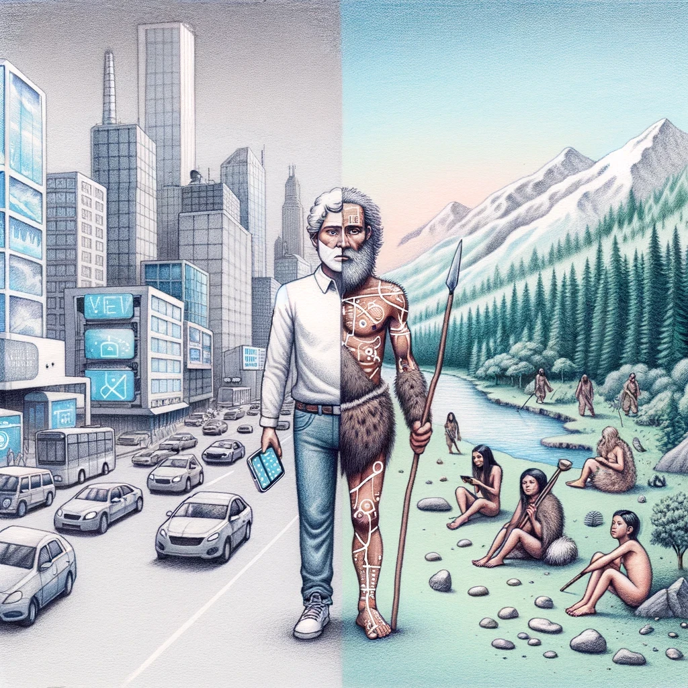

# Introduction
Welcome to the Guide2Life, a structured evidence-based approach to get the most out of life. All changes to this guide are [version controlled.](https://github.com/emanuelefaja/howtolive)

**At the core of this guide is the belief that living well is a skill that can be learned and cultivated through intentional effort and practice.**

Drawing from a wide range of disciplines, including psychology, philosophy, health sciences, and personal development, Guide2Life offers a structured approach to understanding and optimizing various aspects of your life. Whether you're seeking to improve your physical health, build stronger relationships, make better decisions, or find a deeper sense of purpose, this guide will provide you with practical strategies and insights to help you along the way.

But it's not just about hitting all your goals, it's about finding contentment and peace regardless of the situations you find yourself in.

## A Philosophy of Life

Having a meaningful life means having a grand goal for living. This grand goal serves as the foundation of a well-developed philosophy of life, guiding our choices, actions, and priorities (Irvine, 2009). It is about understanding what we want _out_ of life, rather than merely what we want _in_ life.

In other words, a philosophy of life is not just about accumulating possessions, achievements, or experiences. It is about identifying the deeper purpose and meaning that we seek to derive from our existence. It involves asking fundamental questions such as: What kind of person do I want to be? What values do I want to embody? How can I make a positive difference in the world?

Developing a philosophy of life is a deeply personal process that requires introspection, self-reflection, and a willingness to challenge our assumptions and beliefs. It means taking an honest look at our strengths, weaknesses, passions, and fears, and using these insights to craft a vision for the kind of life we want to lead.

One of the key benefits of having a well-defined philosophy of life is that it provides a sense of direction and purpose, even in the face of adversity or uncertainty. When we have a clear understanding of what truly matters to us, we are better equipped to make difficult decisions, overcome obstacles, and stay true to ourselves.

Moreover, a philosophy of life is not a fixed or rigid set of rules, but rather a dynamic and evolving framework that grows and changes as we do. As we navigate through different stages and experiences of life, our values, priorities, and goals may shift, and our philosophy of life must adapt accordingly.

Ultimately, developing a philosophy of life is about taking an active and intentional approach to living. It is about moving beyond the default settings of societal expectations and external pressures, and instead charting our own course based on what we believe to be true, meaningful, and fulfilling. By doing so, we create the conditions for a life that is rich in purpose, joy, and personal growth.

## Playing The Odds.

You can do everything wrong, and terrible things can still happen, and vice-versa. There are people who smoke 40 cigarettes a day and live to be 95 without any health issues, and others who have never smoked a day in their lives who develop lung cancer. However, you can only control what you can control.

The way to think about your life is to consider what would happen if you were to live your life 1,000 times. What would be the most likely outcomes? For smokers who spoke 40 ciggrates, xx% die of cancer. 

## Rationale

Modern life presents unique challenges for our 200,000-year-old brains. Our minds, evolved for a hunter-gatherer lifestyle, must now navigate a world of technological advancements, information overload, and rapid societal changes. 

The root of most of life's problems lies in the mismatch between our ancient brains and the modern world we inhabit. Our brains are wired for survival in a world that no longer exists, leading to cognitive biases, emotional struggles, and maladaptive behaviors that can hinder our well-being and success.

Many individuals struggle to find proper guidance, relying on trial and error to navigate personal and professional challenges. Schools teach us maths and geography, but not the art of conversation or how to make critical decisions. The abundance of self-help resources in the digital age can also lead to confusion and difficulty distinguishing evidence-based advice from opinion, speculation, and click-bait.

Guide2Life addresses these challenges by curating and synthesizing the best available evidence from various disciplines. 

The goal is not to prescribe a singular path to a live well lived, but rather to provide a reliable resource for those seeking to live a more intentional, fulfilling, and well-rounded life, offering a framework for self-discovery and personal growth adaptable to individual circumstances and aspirations.

## Evidence-based Approach
Guide2Life is based on evidence, not personal opinion. The guide references peer-reviewed studies and reports from reputable organizations whenever possible. If new evidence emerges that contradicts current findings, the guide will be updated accordingly.

That said, the information here is also based on thousands of discussions with individuals across the world, asking about their experiences, challenges, and insights on living a fulfilling life. 

The content blends scientific research, practical advice, and philosophical wisdom in an accessible format, serving as a reference for specific topics and a starting point for further education.

## Personal Responsibility
Ultimately, you are responsible for your life.  Guide2Life provides guidance and evidence-based recommendations, but you should do what’s best for you. Adapt the advice to your unique situations and make decisions based on your personal values and goals.

## References 

- Irvine, W. B. (2009). A Guide to the Good Life: The ancient art of Stoic joy. Oxford University Press.

