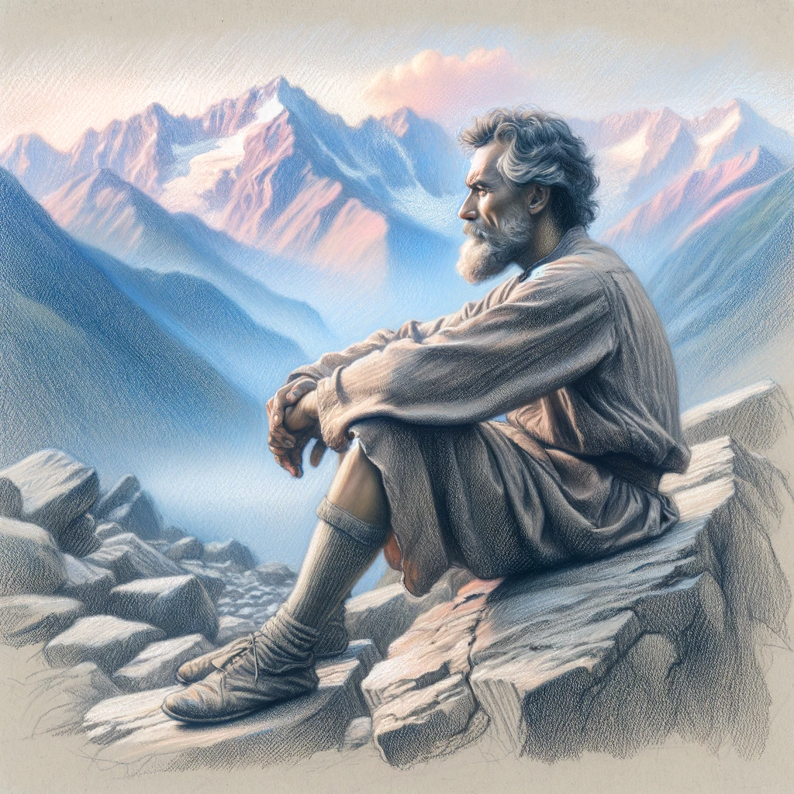

# A Philosophy of Life

> **Philosophy**, from the Ancient Greek words '*philos'* (love) and *'sophia'* (wisdom), means *"love of wisdom."* 

It's the study of fundamental questions about existence, knowledge, values, reason, mind, and language. 

So we can define a **philosophy of life** as a set of beliefs and principles that help you:

1. Understand the world 
2. Take actions  based on your understanding

Guide2Life is designed to help you create a philosophy of life that works for you. 

## Universal, Inevitable, Essential.
**Having a philosophy of life is not optional —  everyone has a 'philosophy' by which they live, consciously or not, making a philosophy of life universal, inevitable and essential. [^hadot]**

We all live according to certain goals and values. These may not be clear to you, meaning that you are more likely to be influenced by other people.  

Having a meaningful life requires having a grand goal for living.  The definition of *grand goal for living* is the goal that, above all others, _you would not sacrifice for anything else.

This grand goal serves as the foundation of a well-developed philosophy of life, guiding our choices, actions, and priorities.

So a philosophy of life defines what we want _out_ of life, rather than merely what we want _in_ life. [^irvine]
## What We Want Out of Life
In other words, a philosophy of life is not just about accumulating possessions, achievements, or experiences. These are things we want *in* life, not *out* of life. 

It is about identifying the deeper purpose and meaning that we seek to derive from our existence. It involves asking fundamental questions such as: 

- What kind of person do I want to be? 
- What values do I want to embody? 
- How can I make a positive difference in the world?

Developing a philosophy of life is a deeply personal process requiring introspection, self-reflection, and a willingness to challenge our assumptions and beliefs. This involves an honest evaluation of our strengths, weaknesses, passions, and fears. Then, we can use these insights  to craft a vision for the kind of life we want to lead.

A well-defined philosophy provides a sense of direction and purpose, even in the face of adversity or uncertainty. With a clear understanding of what matters to us, we are better equipped to take difficult decisions, overcome obstacles, and stay aligned to our values. 

Decisions, and life, become easier. You do not have to think or react to all situations as they come, because often the path forwards will be obvious. 

## Dynamic and Adaptable
> "When the facts change, I change my mind. What do you do, sir?" 
> **John Maynard Keynes.**

A philosophy of life is not a fixed set of rules — it evolves as we grow and change. 

As we navigate through different stages and experiences of life, our values, priorities, and goals may shift. Our philosophy of life must adapt accordingly.

Life is unpredictable, and if you look back, you can sometimes hardly recognize the person that you were even ten years ago, let alone across a typical lifespan of 80+ years. 

> "Everyone has a plan until they get punched in the mouth." **Mike Tyson.**

Major life events, such as career changes, relationships, or personal challenges, can prompt a reevaluation and adjustment of one's philosophy. It's essential to be open-minded and receptive to new ideas, experiences, and perspectives that may challenge or expand your current philosophy.

> "If you want to make God laugh, tell him about your plans." **Woody Allen.**

While it's important to have a core set of values and principles, maintaining flexibility in their application and interpretation is crucial. Life's unpredictable nature necessitates a flexible and adaptable approach to one's philosophy, allowing for growth and change. Continuous learning and self-reflection play a vital role in refining and evolving one's philosophy over time.

> "Failing to plan is planning to fail." **Benjamin Franklin.**

While planning is essential, being ready to adjust when faced with unforeseen obstacles is equally critical. When we plan anything, we should do it knowing that things *won't* go quite according to plan — and we should be okay with that. There is a slight degree of fatalism here, but a healthy amount. 

Cultivating a "beginner's mind" and maintaining an open perspective when reassessing one's philosophy requires humility and a willingness to admit when revisions are needed based on new insights or experiences. A dynamic and adaptable philosophy of life demonstrates strength, resilience, and a commitment to personal development in an ever-changing world.

## Intentional Living

**Ultimately, developing a philosophy of life is having an active and intentional approach to living.** 

It is moving beyond the default settings of societal expectations and external pressures, and instead charting our own course based on what we believe to be true, meaningful, and fulfilling. 

By doing so, we create the conditions for a life that is rich in purpose, joy, and personal growth.

## References 
[^hadot]: Hadot, P., 1995. _Philosophy as a Way of Life_. Oxford, UK: Blackwell Publishing.
[^irvine]: Irvine, W. B. (2009). A Guide to the Good Life: The ancient art of Stoic joy. Oxford University Press.

